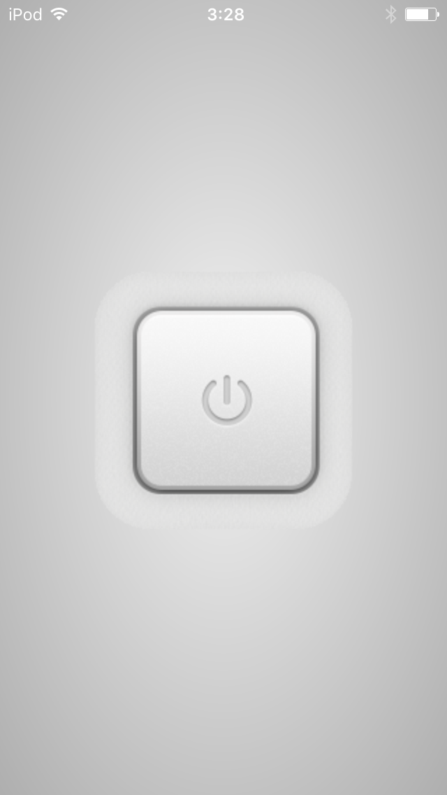

# Hue Switch

Simply on/off toggle Philips Hue lighets Web-app switch.

## usage
- Create user from debugger.
  - Read this: http://ktkne.st/elab/post/2013/philips-hue-api-javascript.html
- Set your IP of Hue & Username to modify `script.js`.
- Launch it.

## Thanks
Switch graphics by <a href="http://365psd.com/day/3-267/" title="Power Button" target="_blank">365PSD.com</a>
